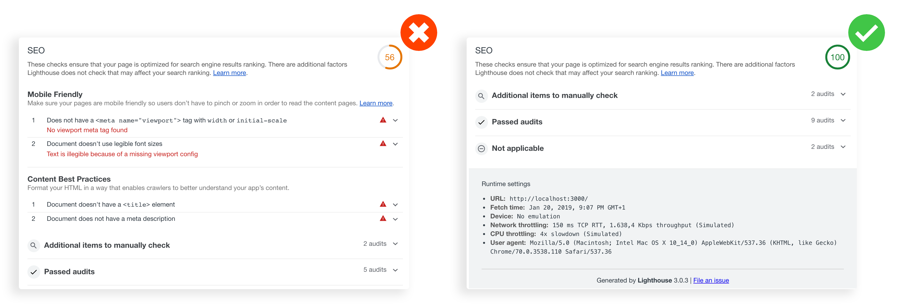

# React Seo Expert [](https://github.com/RichardLitt/standard-readme)


React Seo Expert is a plugin for [React.js](https://reactjs.org/) projects with [Next.js](https://nextjs.org/) library.

Text analysis and assessment library in JavaScript based on [The Open Graph protocol](http://ogp.me/), [Google Site Verification](https://developers.google.com/site-verification/) and [Twitter Cards](https://developer.twitter.com/en/docs/tweets/optimize-with-cards/guides/getting-started.html). 

### Without and With React Seo Expert


## Installation
You can install React Seo Expert using npm:

```bash
npm install react-seo-expert
```

## Usage
You can either use React Seo Expert using the web worker API or use the internal components directly.

Because a web worker must be a separate script in the browser you first need to create a script for inside the web worker:

```js
import Head from 'next/head';
import React from 'react';
import Seo from 'react-seo-expert';

class Index extends React.Component {
  render() {
    const SEO = {
      "keywords": "",
      "author": "",
      "copyright": "",
      "email": "",
      "language": "",
      "robots": "",
      "google_site_verification": "",
      "viewport": "",
      "title": "",
      "description": "",
      "locale": "",
      "type": "",
      "image": "",
      "video": "",
      "audio": "",
      "url": "",
      "twitter_card": "",
      "twitter_site": "",
      "twitter_creator": ""
    }
    return (
      <div>
        <Head>
          <title>{SEO.title}</title>
        </Head>
        <Seo config={SEO} />
      </div>
    );
  }
}
export default Index;
```

## More Info
[The Open Graph protocol](http://ogp.me/) \
[Google Site Verification](https://developers.google.com/site-verification/) \
[Tweets with Cards](https://developer.twitter.com/en/docs/tweets/optimize-with-cards/guides/getting-started.html)

## Maintainers
 \
[@JoseJPR](https://github.com/JoseJPR)

## License
[MIT](LICENSE.md)

## Happy Code
Created with JavaScript, lot of ❤️ and a few 🍺